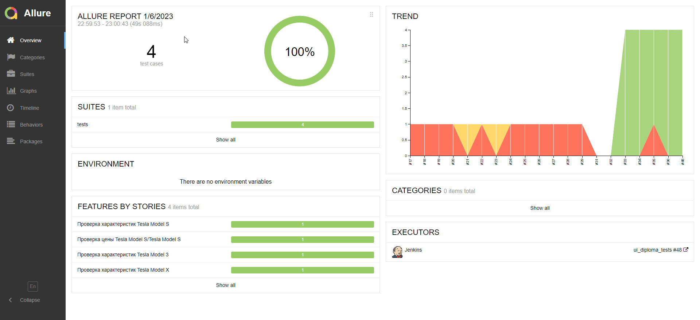
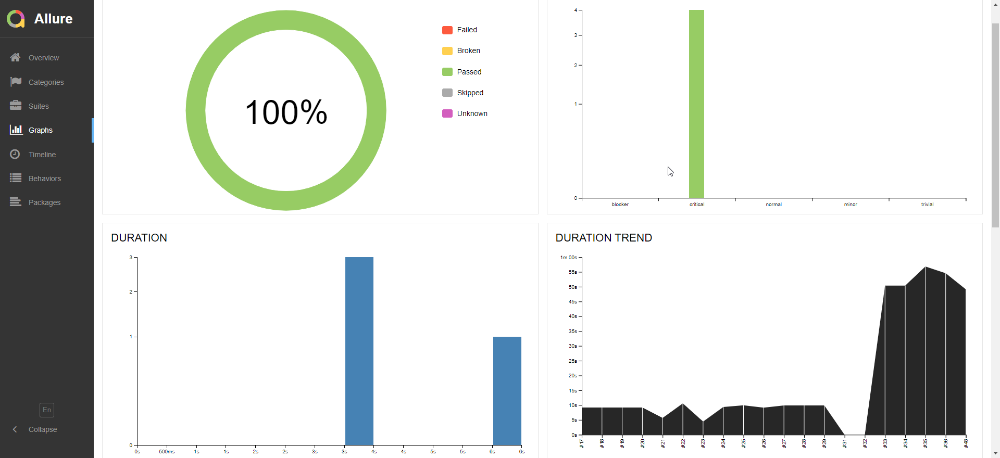
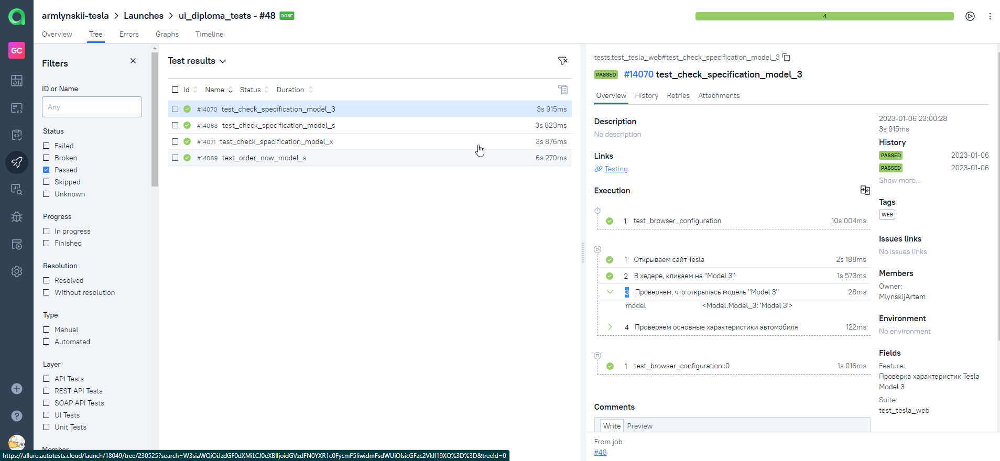

## Project UI autotests for Tesla
<!-- Technology -->

### Используемые инструменты и фреймворки:

  <code></code>
  <code></code>
  <code></code>
  <code></code>
  <code></code>
  <code></code>
  <code></code>
  <code></code>
  <code></code>
  <code></code>
  <code></code>
  <code></code>
  <code></code>

<!-- Тест кейсы -->

### Что проверяют автотесты:
* Проверка основных характеристик автомобиля "Tesla Model S"
* Покупка нового автомобиля "Tesla Model S"
* Проверка спецификаций "Tesla Model 3"
* Проверка спецификаций "Tesla Model S"

<!-- Jenkins -->

###  Запуск проекта в Jenkins

### [Job](https://jenkins.autotests.cloud/job/ui_diploma_tests/)

##### Когда нажимаем "Собрать сейчас" начинается сборка билда, запустятся тесты. Тесты проходят на виртуальной машине в Selenide.

##### Пример прохождения теста в Selenide:

<!-- Allure report -->

###  Allure report

##### После прохождения тестов, результаты можно посмотреть в Allure отчете, где так же содержится ссылка на Jenkins

##### Во вкладке Graphs можно посмотреть графики о прохождении тестов, по их приоритезации, по времени прохождения и др.

##### Во вкладке Suites находятся собранные тест кейсы, у которых описаны шаги и приложены логи, скриншот и видео о прохождении теста

<!-- Allure TestOps -->

###  Интеграция с Allure TestOps

### [Dashboard](https://allure.autotests.cloud/project/1720/dashboards)

##### Так же вся отчетность сохраняется в Allure TestOps, где строятся аналогичные графики.

#### Во вкладке со сьютами, мы можем:
- Управлять всеми тест-кейсами или с каждым отдельно
- Перезапускать каждый тест отдельно от всех тестов
- Настроить интеграцию с Jira
- Добавлять ручные тесты и т.д

<!-- Jira -->

###  Интеграция с Jira
##### Настроив через Allure TestOps интеграцию с Jira, в тикет можно пробросить результат прохождение тестов и список тест-кейсов из Allure

<!-- Telegram -->

###  Интеграция с Telegram
##### После прохождения тестов, в Telegram bot приходит сообщение с графиком и небольшой информацией о тестах.

